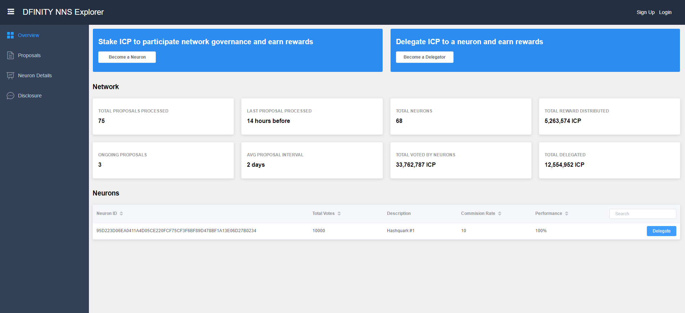

## An open DFINITY NNS Explorer.



### Demo

[Screenshot](./screenshoots/1.png)

Install the required Node modules (only needed the first time).

```bash
npm install
```

Start the replica, then build and install the canisters.

```bash
dfx start --background
dfx canister create --all
dfx build
dfx canister install --all
```

Open the canister frontend in your web browser. (http://127.0.0.1:8000/?canisterId=*******************)
